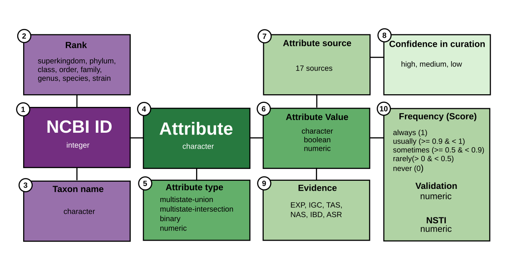

```{r, include = FALSE}
knitr::opts_chunk$set(
    collapse = TRUE,
    comment = "#>"
)
```

# Introduction

The bugphyzz package offers a convenient way to import a collection of
harmonized microbial annotations from various sources into R.
These annotations are available on [Zenodo](https://zenodo.org/doi/10.5281/zenodo.10980653).
In addition to being harmonized, some annotations have been extended to
other taxa based on the phylogeny from
[‘The All-Species Living Tree Project’](https://imedea.uib-csic.es/mmg/ltp/)
using ancestral state reconstruction (ASR) methods.
The annotations are provided in tabular format and organized into distinct
tidy `data.frame` objects
(for details, see the “Data schema” section below).

Once imported, these `data.frame` objects can be used to create microbial
signatures, which are lists of taxa with shared characteristics.
We anticipate these signatures being utilized for enrichment analysis of
microbiome omic data by implementing workflows similar to those used in
gene set enrichment analysis; for example, using the
[EnrichmentBrowser](https://bioconductor.org/packages/release/bioc/html/EnrichmentBrowser.html)
package (a detailed example is provided in a section below).

A similar package in Bioconductor is the [bugsigdbr](https://bioconductor.org/packages/release/bioc/html/bugsigdbr.html)
package, which imports literature-published microbial signatures from the
[BugSigDB](https://bugsigdb.org/Main_Page) database and has been used for
bug set enrichment analysis (BSEA). Moreover, the [writeGMT function](https://bioconductor.org/packages/release/bioc/vignettes/bugsigdbr/inst/doc/bugsigdbr.html#13_Writing_microbe_signatures_to_file_in_GMT_format)
from the bugsigdbr package can export bugphyzz signatures as GMT text
files.

# Data schema

Annotations in bugphyzz represent the link between a taxon (Bacteria/Archaea)
and an attribute, as outlined in the data schema provided below.

<center>

{width="100%"}

</center>

**Taxon-related**

Taxonomic data in bugphyzz is standardized according to the NCBI taxonomy:

1. _NCBI ID_: An integer representing the NCBI taxonomy ID (taxid) associated
with a taxon.
2. _Rank_: A character string indicating the taxonomy rank,
including superkingdom, kingdom, phylum, class, order, family, genus, species,
or strain.
3. _Taxon name_: A character string denoting the scientific name of the taxon.

**Attribute-related**

Attribute data is harmonized using 
ontology terms. Details of attributes, ontology terms, and ontology libraries
can be found in the [Attribute and sources](articles/attributes.html) article.

4. _Attribute_: A character string describing the name of a trait that can be
observed or measured.
5. _Attribute type_: A character string indicating the data type:
    * numeric: Attributes with numeric values (e.g., growth temperature: 25°C).
    * binary: Attributes with boolean values (e.g., butyrate-producing: TRUE).
    * multistate-intersection: A set of related binary attributes
    (e.g., habitat).
    * multistate-union: Attributes with three or more values represented as
    character strings (e.g., aerophilicity: aerobic, anaerobic,
    or facultatively anaerobic).
6. _Attribute value_: The possible values that an attribute could take,
represented as character strings, booleans, or numbers.

**Attribute value-related**

Metadata associated with attribute values:

7. _Attribute source_: The source of the information.
8. _Evidence_: The type of evidence supporting an annotation, including:
    * EXP: Experiment
    * IGC: Inferred from genomic context
    * TAS: Traceable author statement
    * NAS: Non-traceable author statement
    * IBD: Inferred from biological aspect of descendant
    * ASR: Ancestral state reconstruction

9. _Support values_:
    * Frequency and Score: Confidence that a given taxon exhibits a trait
    based on the curator’s knowledge or results of ASR or IBD.
    * Validation: Score from the
    [10-fold cross-validation analysis](https://github.com/waldronlab/taxPProValidation).
    Matthews correlation coefficient (MCC) for discrete attributes and
    R-squared for numeric attributes. Default threshold value is 0.5 and above.
    * NSTI: Nearest sequence taxon index from [PICRUSt2](https://www.ncbi.nlm.nih.gov/pmc/articles/PMC7365738/)
    or the [castor package](https://cran.r-project.org/web/packages/castor/index.html).
    Relevant for numeric values only.

**Attribute source-related**

10. _Confidence in curation_: A character string indicating the confidence
value of a source based on three criteria: 1) presence of a source, 2) valid
references, and 3) peer-reviewed curation.
Valid options include high, medium, or low, corresponding to satisfaction of
three, two, or one of these criteria.

**Additional information**

+ Description of **sources** and **attributes**:
https://waldronlab.io/bugphyzz/articles/attributes.html

+ Description of ontology **evidence** codes:
https://geneontology.org/docs/guide-go-evidence-codes/

+ Description of **frequency** keywords and scores were based on:
https://grammarist.com/grammar/adverbs-of-frequency/

+ IBD and ASR were performed with taxPPro:
https://github.com/waldronlab/taxPPro

# Analysis and Stats

This vignette serves as an introduction to the basic functionalities of
bugphyzz. For a more in-depth analysis and detailed statistics
utilizing bugphyzz annotations, please visit:
https://github.com/waldronlab/bugphyzzAnalyses

# Installation

```{r, eval=FALSE}
if (!require("BiocManager", quietly = TRUE))
    install.packages("BiocManager")

BiocManager::install("bugphyzz")
```

# Import bugphyzz data

Load the bugphyzz package and additional packages for data manipulation:

```{r load package, message=FALSE}
library(bugphyzz)
library(dplyr)
library(purrr)
```

bugphyzz data is imported using the `importBugphyzz` function,
resulting in a list of tidy data frames. Each data frame corresponds to an
attribute or a group of related attributes. This is particularly evident in
the case of the multistate-union type described in the data schema above,
where related attributes are grouped together in a single data frame. Available
attribute names can be inspected with the `names` function:

```{r import data, message=FALSE}
bp <- importBugphyzz()
names(bp)
```

Let's take a glimpse at one of the data frames:

```{r a glimpse}
glimpse(bp$aerophilicity, width = 50)
```

Compare the column names with the data schema described above.

# Create microbial signatures

bugphyzz's primary function is to facilitate the creation of microbial
signatures, which are essentially lists of microbes sharing specific taxonomy
ranks and attribute values. Once the data frames containing attribute
information are imported, the `makeSignatures` function can be employed to
generate these signatures. `makeSignatures` offers various filtering options,
including evidence, frequency, and minimum and maximum values for numeric
attributes. For more precise filtering requirements, users can leverage
standard data manipulation functions on the relevant data frame,
such as `dplyr::filter`.

Examples:

+ Create signatures of taxon names at the genus level for the aerophilicity
attribute (discrete):

```{r}
aer_sigs_g <- makeSignatures(
    dat = bp[["aerophilicity"]], taxIdType = "Taxon_name", taxLevel = "genus"
)
map(aer_sigs_g, head)
```

+ Create signatures of taxon names at the species level for the growth
temperature attribute (numeric):

```{r}
gt_sigs_sp <- makeSignatures(
    dat = bp[["growth temperature"]], taxIdType = "Taxon_name",
    taxLevel = 'species'
)
map(gt_sigs_sp, head)
```

+ Create signatures with a custom threshold for the growth temperature
attribute (numeric):

```{r}
gt_sigs_mix <- makeSignatures(
    dat = bp[["growth temperature"]], taxIdType = "Taxon_name",
    taxLevel = "mixed", min = 0, max = 25
)
map(gt_sigs_mix, head)
```

+ Create signatures for the animal pathogen attribute (boolean):

```{r}
ap_sigs_mix <- makeSignatures(
    dat = bp[["animal pathogen"]], taxIdType = "NCBI_ID",
    taxLevel = "mixed", evidence = c("exp", "igc", "nas", "tas")
)
map(ap_sigs_mix, head)
```

+ Create signatures for all of the bugphyzz data frames:

```{r}
sigs <- map(bp, makeSignatures) |> 
    list_flatten(name_spec = "{inner}")
length(sigs)
```

```{r}
head(map(sigs, head))
```

# Run a bug set enrichment analysis

Bugphyzz signatures are suitable for conducting bug set enrichment analysis
using existing tools available in R. In this example, we will perform a set
enrichment analysis using a dataset
with a known biological ground truth.

The dataset originates from the Human Microbiome Project (2012) and compares
subgingival and supragingival plaque.
This data will be imported using the
[MicrobiomeBenchmarkData package](https://bioconductor.org/packages/release/data/experiment/html/MicrobiomeBenchmarkData.html).
For the implementation of the enrichment analysis, we will utilize the
Gene Set Enrichment Analysis (GSEA) method available in the
[EnrichmentBrowser package](https://bioconductor.org/packages/release/bioc/html/EnrichmentBrowser.html).
The expected outcome is an enrichment of aerobic taxa in the supragingival
plaque (positive enrichment score) and anaerobic taxa in the subgingival plaque
(negative enrichment score).


Load necessary packages:

```{r, message=FALSE}
library(EnrichmentBrowser)
library(MicrobiomeBenchmarkData)
library(mia)
```

Import benchmark data:

```{r, warning=FALSE}
dat_name <- 'HMP_2012_16S_gingival_V35'
tse <- MicrobiomeBenchmarkData::getBenchmarkData(dat_name, dryrun = FALSE)[[1]]
tse_genus <- mia::splitByRanks(tse)$genus
min_n_samples <- round(ncol(tse_genus) * 0.2)
tse_subset <- tse_genus[rowSums(assay(tse_genus) >= 1) >= min_n_samples,]
tse_subset
```

Let's use the edgeR method for differential abundance analysis and
obtain sets of microbes.
Subgingival plaque will be used as reference
or "control", so negative values will mean enrichment in the subgingival plaque
and positive values will mean enrichment in the supragingival plaque.

Perform differential abundance (DA) analysis:

```{r}
tse_subset$GROUP <- ifelse(
    tse_subset$body_subsite == 'subgingival_plaque', 0, 1
)
se <- EnrichmentBrowser::deAna(
    expr = tse_subset, de.method = 'edgeR', padj.method = 'fdr', 
    filter.by.expr = FALSE, 
)
```

It's recommended to perform a normalization step of the counts before
running GSEA. From the original [GSEA user guide](https://www.gsea-msigdb.org/gsea/doc/GSEAUserGuideTEXT.htm):
"GSEA does not normalize RNA-seq data.
RNA-seq data must be normalized for between-sample comparisons using an
external normalization procedure (e.g. those in DESeq2 or Voom)."

In this example, we are treating the microbiome
data as RNA-seq (see: https://link.springer.com/article/10.1186/s13059-020-02104-1).
Let's use the `limma::voom` function.

A glimpse to the assay stored in the SE:

```{r}
assay(se)[1:5, 1:5] # counts
```

From the `?limma::voom` documentation, input should be "a numeric matrix
containing raw counts...". Note that the assay in the SummarizedExperiment
will be replaced with normalized counts.

Perform normalization step:

```{r}
dat <- data.frame(colData(se))
design <- stats::model.matrix(~ GROUP, data = dat)
assay(se) <- limma::voom(
    counts = assay(se), design = design, plot = FALSE
)$E
```

The output is a "numeric matrix of normalized expression values on the
log2 scale" as described in the `?lima::voom` documentation. This output
is ready for GSEA.

```{r}
assay(se)[1:5, 1:5] # normalized counts
```

Perform GSEA and display the results:

```{r, message=FALSE}
gsea <- EnrichmentBrowser::sbea(
    method = 'gsea', se = se, gs = aer_sigs_g, perm = 1000,
    # Alpha is the FDR threshold (calculated above) to consider a feature as
    # significant.
    alpha = 0.1
)
gsea_tbl <- as.data.frame(gsea$res.tbl) |> 
    mutate(
        GENE.SET = ifelse(PVAL < 0.05, paste0(GENE.SET, ' *'), GENE.SET),
        PVAL = round(PVAL, 3),
    ) |> 
        dplyr::rename(BUG.SET = GENE.SET)
knitr::kable(gsea_tbl)
```

# Get signatures associated with a specific microbe

To retrieve all signature names associated with a specific taxon,
users can utilize the `getTaxonSignatures` function.

Let's see an example using _Escherichia coli_ (taxid: 562).

Get all signature names associated to _E. coli_:

```{r, message=FALSE}
getTaxonSignatures(tax = "Escherichia coli", bp = bp)
```

Get all signature names associated to the _E. coli_ taxid:

```{r}
getTaxonSignatures(tax = "562", bp = bp)
```

# Session information

```{r}
sessioninfo::session_info()
```
